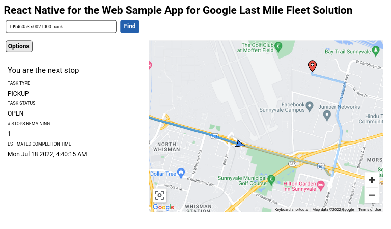

# React Native for the Web Sample App for Google Last Mile Fleet Solution

## Prerequisites

1. Complete [Getting Started with Fleet Engine](https://developers.google.com/maps/documentation/transportation-logistics/last-mile-fleet-solution/shipment-tracking/fleet-engine/deliveries_api).
2. Run [backend](https://github.com/googlemaps/last-mile-fleet-solution-samples/tree/main/backend).
3. Run the driver mobile app to create vehicles and shipment tasks to track with the React Native Web sample app.

## Getting started

### Step 1 - Download and install dependencies

These dependencies are needed to run the sample app. If you have them installed already you can skip these steps below.

- Download & install node from https://nodejs.org/en/download/
- Download & install expo CLI:

```
npm install --global expo-cli
```

### Step 2 - Populate `./node_modules`

This will install all packages declared in `package.json` of the sample project to make sure all dependencies are properly installed.

```
npm install --legacy-peer-deps
```

### Step 3 - Add API key and other metadata (required)

In `/src/utils/consts.tsx`, do the following:

- Set the `PROVIDER_URL` constant to the URL of your provider that was set up in Prerequisite #2.
- Set the `PROVIDER_PROJECT_ID` constant to your Cloud project ID
- Set the `API_KEY` constant to your Google Maps API key

```typescript
// Replace 'YOUR_PROVIDER_URL' with the URL of the backend. See
// https://github.com/googlemaps/last-mile-fleet-solution-samples/blob/main/getting-started.md#launch-the-apps
// for instructions on how to set up a provider.
export const PROVIDER_URL = 'YOUR_PROVIDER_URL';
export const PROVIDER_PROJECT_ID = 'YOUR_PROJECT_ID';
export const API_KEY = 'YOUR_API_KEY';
```

### Step 4 - Run the sample app

From this directory, run `npm run web` to start a development server. The app will automatically reload if you change any of the source files.

### Step 5 - Start tracking a shipment task

Enter a tracking ID for a shipment task you created (Prerequisite #3) in the Tracking ID input field and click "Find".



## Important references

- [Installing Cloud SDK](https://cloud.google.com/sdk/docs/install)
- [Track Shipments with JavaScript Shipment Tracking LIbrary](https://developers.google.com/maps/documentation/transportation-logistics/last-mile-fleet-solution/shipment-tracking/how-to/track_shipment)
